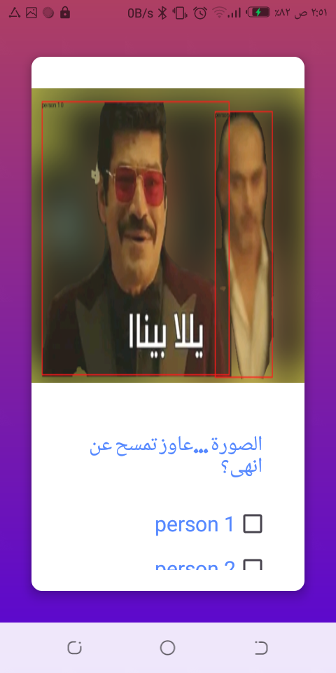

# Pandas Background V 1.0

- It's a small tool ,fashioned utilizing new AI to remove/replace /Tof of different things from media files (Image /Video)
- the app is working /deployed on [HuggingFace](https://huggingface.co/spaces/taha454/Backg)

## Table of Contents
- [Installation](#installation)
- [Features](#features)
- [Usage](#usage)
- [Architecture](#architecture)
- [Third part app](#thirdapp)
- [Future Work](#futurecase)
- [Contributing](#contributing)
- [License](#license)

## Installation
1. Download the file from the [PandasBackground](https://github.com/username/repo).
2. Accept Premession.

## Features
1. Remove Background from Image
2. Replace Bacground of Image 
3. Camera TOF effect for image
4. Support English and Arabic (Egypt)
5. Removing from any person /thing independently
6. same for video ,and relace with video frame (future)

## Usage
after accepting premession you will get to the main menu then
1. Remove Background 
2. Replace Bacground : specify main image and background
3. Camera TOF : specify main image and  degree of TOF (normal is 33)
4. After that  you will redirect to screen ,seeing we found things *(person /animal / transport)* on some position with id ,select those you want to keep

5. Support arabic (egypt) and english as default ,by phone language

 
## Architecture

### Language
- android with java
- python backend with fastapi 

this github contain 2 directories:
### 1. Python choosing model:
 this is 2 python notebook :
 - declare the  main functions that used to modify image /video
 - trying to explore many models  to get one with  **good result for most images** and **Fast**
 I explored those models:
    - zhoubolei/scene_parse_150
    - facebook/detr-resnet-101-panoptic
    - kiheh85202/yolo
    - ultralyticsplus yolo and this gets best results

### 2. Android source code:
- this is main android code 
- for organizing i divided into directories for organized work
- Choose Exist image : i made some of it's code but not worked as i get problem of sending drawable image to server (after save to file)
- the broadcast reciever when sending image don't do important thing more than display toast.

### FastAPI backend code:
the code of it in [Backg](https://huggingface.co/spaces/taha454/Backg)

the code is in 2 files app, server 
- server : in the notebook I implemented the function to modify image ,for deploy to make seperation on data I but on **object** SegmenterBackground so each call ,call seperate object
- app : this contain the fastapi app file 
    - some functions return stream / File/encoded image (when send many data output) depend on need type
    - when necessary some function reture status code 

## ThirdApp
- Huggingface
- Glide library for GIF
- HTTP client

## FutureCase

- **Compitability Issue**: Orginally tested on android 8 ,not tested on other versions.
- **Video**: currently not supported in app ,but in server it work but with no sound in output.
- **Choose Exist image**: currently not supported in app ,although you can find some of it's java code.
- **Limit**: for fair work the limit should be added (this have the code but not applied) 
- **Need more cleaning** : to make all server functions return status code and handling this ti prevent unexpected behaviour

## Contributing
**Report Bugs**: If you find a bug, please open an issue on GitHub.

## License
This project is not licensed for public use. Please contact me for more information.
